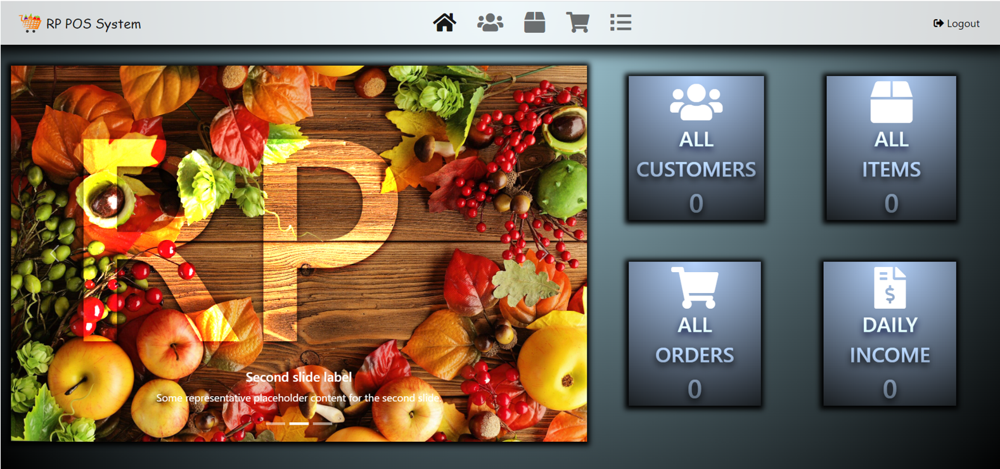

# *About* ❓
**This is my Jquery POS System**.

<h3 align="center"></h3>

# *Introduction* 📝
This is a single page application in memory Pos System.
This POS System is created using HTML , CSS for Web interface and JQuery used for implement functions.

# *Objectives* 🔑
Implement Single Page Application

# *Role* ✒
* Admin

# *System Requirements* 📞
1. Add Customers
2. Add Items
3. Place A Order
4. Search Order
 
